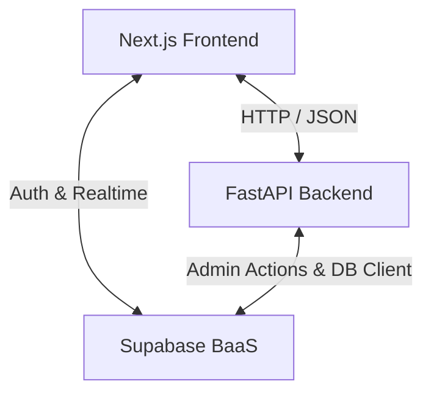

# 🎯 CuraReb - Physiotherapy Recovery Marketplace

CuraReb (also known as Kyura Care Rehabilitation) is a premium, production-ready, full-stack web application designed as a marketplace for post-accident rehabilitation and long-term care. It connects patients undergoing rehabilitation with specialized physiotherapists and medical recovery professionals through a secure, high-fidelity, and visually stunning digital experience.

The platform boasts a decoupled architecture featuring a modern Next.js frontend, a robust FastAPI backend service, and Supabase for unified authentication, identity management, and persistent database storage.

---

## 🏗️ Architecture & Technology Stack

CuraReb follows a high-performance client-server model reinforced with a Backend-as-a-Service (BaaS) layer for database and user identity security.



### 💻 Frontend (Client)
*   **Framework:** **Next.js 16** (App Router, React Server Components for highly optimized initial page loads).
*   **Core Library:** **React 19** & **TypeScript** (ensuring complete static type safety across forms, API requests, and UI props).
*   **Styling:** **Tailwind CSS v4** combined with **Shadcn UI** (Radix UI primitives customized for a clean, cohesive, "Apple-level" medical aesthetic).
*   **Animations:** **Framer Motion** for premium micro-interactions, page state transitions, staggered list displays, and sleek hover effects.
*   **State & Auth Bindings:** `@supabase/ssr` and `@supabase/supabase-js` for robust browser/server session management.
*   **Utilities:** `lucide-react` for responsive icon packages and `sonner` for rich toast notifications.

### 🐍 Backend (API)
*   **Framework:** **FastAPI** (an async, high-performance Python web framework for microsecond latency endpoints).
*   **Language:** **Python 3.11+**
*   **Validation:** **Pydantic v2** for deep request/response verification and model consistency.
*   **Database Interface:** `supabase-py` for executing complex relational queries with PostgreSQL.
*   **Deployment Server:** Uvicorn (ASGI web server for reliable local and remote hot-reloads).

### 🔒 Database & Infrastructure
*   **Storage & Querying:** **PostgreSQL** running on **Supabase**.
*   **Authentication:** Supabase Auth (supports secure Email/Password, secure session handling via Middleware, and JWT token passing).
*   **Security:** **Row Level Security (RLS)** active at the database layer to restrict patient, doctor, and consultation records strictly to authorized account roles.

---

## 📂 Project Structure Map

```text
Kyura-Care-Rehabilitation/
├── backend/                        # FastAPI Python Backend
│   ├── main.py                     # API Gateway entry & router configurations
│   ├── database.py                 # Supabase client instance & connection settings
│   ├── dependencies.py             # FastAPI route dependencies (JWT checks & roles)
│   ├── schemas.py                  # Pydantic data schemas (requests & responses)
│   ├── requirements.txt            # Python dependencies
│   ├── rls_policies.sql            # PostgreSQL Row-Level Security definitions
│   └── routers/                    # Domain-specific API routers
│       ├── appointments.py         # Scheduling consultation slots
│       ├── auth.py                 # Synchronizing user sign-up metadata to profiles
│       ├── doctors.py              # Specialists search, directory, and scheduling
│       ├── patients.py             # Medical histories, files, and recovery timelines
│       ├── reviews.py              # Doctor reviews and feedback rating system
│       └── subscriptions.py        # Long-term care pricing tiers & plans
│
├── frontend/                       # Next.js TypeScript Frontend
│   ├── next.config.ts              # Next.js framework configuration
│   ├── package.json                # Project dependencies, build actions, and lint rules
│   ├── tailwind.config.ts          # Styling design tokens (colors, gradients, animations)
│   └── src/
│       ├── app/                    # Next.js App Router (Pages, Layouts & Middleware)
│       │   ├── auth/               # Login, sign-up, and session callback pages
│       │   ├── dashboard/          # Protected portals for doctors and patients
│       │   │   └── profile/        # Highly editable 4-tab user profile settings
│       │   ├── doctors/            # Directory, advanced search, and filter panels
│       │   ├── treatments/         # Dedicated rehabilitation category showcase
│       │   ├── page.tsx            # High-fidelity, animated landing page
│       │   └── layout.tsx          # Root theme providers, navigation, & global layout
│       ├── components/             # Reusable UI component repository (Shadcn customized)
│       │   ├── ui/                 # Basic building blocks (dropdowns, cards, input, etc.)
│       │   └── navbar.tsx          # Dynamic navigation bar with animated avatar dropdown
│       ├── hooks/
│       │   └── useProfile.ts       # Unified profile fetch, cache, and update React hook
│       ├── lib/                    # Class name mergers and core styles
│       └── utils/                  # Supabase browser, server, and middleware wrappers
```

---

## 🌟 Core Features Showcase

### 1. Unified Authentication & Conditional Identity Profiles
*   **Role-Based Access Control (RBAC):** Users choose to register as either **Patients** or **Doctors (Physiotherapists)**.
*   **Registration Validation:** Doctors are strictly required to input a professional Medical License Number.
*   **Auto-Sync Middleware:** When a new user registers on Supabase Auth, a backend sync hook (`/api/v1/auth/sync-profile`) automatically creates and links a clean profile row in the PostgreSQL database.
*   **Middleware Guard:** Protects routes (like `/dashboard`) from unauthenticated visits by checking active HTTP-only session cookies.

### 2. Complete Profile Management System (0 to Hero)
A complete, premium user management console divided into a responsive 4-tab view:
*   **Patient Profiles:** Captures 8 editable fields (full name, phone, Date of Birth, address, emergency contact, active injury description, and long-term medical history) along with appointment history.
*   **Doctor Profiles:** Manages 10 editable fields (full name, professional bio, specialty, educational background, years of experience, session fees, and weekly consultation availability schedules).
*   **Premium Visuals:** Integrates beautifully animated placeholder avatar badges based on user initials, glassmorphic card overlays, responsive flex grids, skeleton load indicators, and reactive toast notifications.

### 3. Advanced Specialist Directory & Search Engine
*   **Live Search:** Search specialists instantly by full name, expertise, or targeted medical condition.
*   **Dynamic Filters:** Filter specialists instantly by:
    *   **Specialty Checkboxes** (e.g., Neurological, Orthopedic, Sports Injury)
    *   **Consultation Fee Sliders** (ranges from $0 to $500/hr)
    *   **Consultation Type** (Online Consultations toggle vs In-Clinic vs At-Home)
*   **Optimized Performance:** Features smooth skeleton components during data fetching and rich "No Specialists Found" search empty states.

### 4. Interactive Treatments Showcase
A catalog of 6 core physiotherapeutic recovery treatments complete with session schedules, duration details, and recovery benefits:
1.  **Neurological Rehabilitation** (Stroke recovery, Parkinson's management, etc.)
2.  **Orthopedic Therapy** (Joint recovery, fractures, and post-surgery care)
3.  **Cardiac Rehabilitation** (Cardiovascular endurance and healthy heart training)
4.  **Sports Injury Recovery** (Muscle tears, ligament repairs, and athlete endurance)
5.  **Pediatric Physiotherapy** (Developmental support, posture, and motor coordination)
6.  **Chronic Pain Management** (Sciatica, severe arthritis, and physical relief)

---

## 🎨 Design Tokens & Design System

The system operates on an elite "Apple-like" UI philosophy relying on sleek HSL variables, smooth transitions, and glassmorphic micro-layers.

*   **Color Palette:**
    *   *Primary:* Indigo (`#4f46e5` to `#6366f1`) - represents clean professionalism.
    *   *Secondary:* Purple (`#7c3aed` to `#8b5cf6`) - denotes healing and recovery.
    *   *Success:* Emerald (`#10b981`) | *Warning:* Amber (`#f59e0b`) | *Danger:* Red (`#ef4444`).
*   **Premium Radii:** Standardized corners utilizing `1rem` (small) up to `2rem` (large) for pill-like container styling.
*   **Glassmorphism:** Applied globally with `backdrop-blur-xl`, `bg-white/70`, `dark:bg-slate-900/70`, and subtle semi-transparent borders.
*   **Dark Mode:** Standardized across all pages via `next-themes` and fully persistent to user device configurations.

---

## 📊 Core API Endpoints

### 🩺 Doctor-Related Endpoints
*   `GET    /api/v1/doctors` - Retrieve/Search lists of physiotherapists (includes query filters).
*   `GET    /api/v1/doctors/me` - Retrieve the active authenticated doctor's profile.
*   `PUT    /api/v1/doctors/me` - Update the logged-in doctor's professional bio, fee, and specialty details.
*   `PUT    /api/v1/doctors/me/availability` - Update the weekly scheduled availability.
*   `GET    /api/v1/doctors/me/appointments` - Fetch upcoming appointments with patients.
*   `GET    /api/v1/doctors/me/reviews` - Fetch reviews left by patients.

### 👤 Patient-Related Endpoints
*   `GET    /api/v1/patients/me` - Fetch authenticated patient personal profiles.
*   `PUT    /api/v1/patients/me` - Update personal info, medical history, and emergency contact details.
*   `GET    /api/v1/patients/me/appointments` - Fetch the patient's appointment log.
*   `GET    /api/v1/patients/me/documents` - Fetch uploaded medical records and files.

### 🔐 Authentication Endpoints
*   `POST   /api/v1/auth/sync-profile` - Synchronizes a freshly registered Supabase Auth account with the PostgreSQL database.

---

## 🏃 Local Installation & Setup Guide

Ensure you have **Python 3.11+**, **Node.js 18+**, and a active **Supabase Project** before beginning.

### 1. Setup the Database (Supabase)
Apply the contents of `backend/rls_policies.sql` to your Supabase SQL editor to create the necessary profile schemas, sync functions, triggers, and Row Level Security policies.

### 2. Configure the Backend API
1.  Navigate to the `backend` folder:
    ```bash
    cd backend
    ```
2.  Create a virtual environment and activate it:
    ```bash
    python -m venv venv
    # On Windows:
    venv\Scripts\activate
    # On macOS/Linux:
    source venv/bin/activate
    ```
3.  Install Python dependencies:
    ```bash
    pip install -r requirements.txt
    ```
4.  Configure your environment secrets by creating a `.env` file:
    ```env
    SUPABASE_URL="https://your-supabase-project-id.supabase.co"
    SUPABASE_KEY="your-supabase-anon-key"
    SUPABASE_SERVICE_ROLE_KEY="your-supabase-service-role-key"
    ALLOWED_ORIGINS="http://localhost:3000"
    ```
5.  Start the FastAPI server:
    ```bash
    uvicorn main:app --reload
    ```
    *The API will boot and be reachable at `http://127.0.0.1:8000`*

### 3. Configure the Next.js Frontend
1.  Navigate to the `frontend` folder:
    ```bash
    cd ../frontend
    ```
2.  Install Node dependencies:
    ```bash
    npm install
    ```
3.  Configure frontend environment variables by creating a `.env.local` file:
    ```env
    NEXT_PUBLIC_SUPABASE_URL="https://your-supabase-project-id.supabase.co"
    NEXT_PUBLIC_SUPABASE_ANON_KEY="your-supabase-anon-key"
    NEXT_PUBLIC_API_URL="http://127.0.0.1:8000"
    ```
4.  Launch the Next.js development server:
    ```bash
    npm run dev
    ```
    *The web application is now active at `http://localhost:3000`*

---

## 📄 Documentation Directory Reference

For granular details on specific sub-systems, refer to the following documents in the root directory:
*   [PROJECT_OVERVIEW.md](./PROJECT_OVERVIEW.md) - Standard project breakdown and router explanations.
*   [PROFILE_SYSTEM_README.md](./PROFILE_SYSTEM_README.md) - Deep dive into the Patient & Doctor profile module setup.
*   [PROFILE_SYSTEM.md](./PROFILE_SYSTEM.md) - Complete Technical Reference for state management and DB schemas.
*   [UI_IMPROVEMENTS_SUMMARY.md](./UI_IMPROVEMENTS_SUMMARY.md) - Full list of animations, micro-interactions, and visual elements.
*   [BEFORE_AFTER.md](./BEFORE_AFTER.md) - visual comparisons of old UI views versus the updated Glassmorphism styles.
*   [FEATURES_SHOWCASE.md](./FEATURES_SHOWCASE.md) - Detailed breakdown of user-facing dashboard actions.
*   [IMPLEMENTATION_COMPLETE.md](./IMPLEMENTATION_COMPLETE.md) - Total production checklist and testing plans.

---
*Developed with ❤️ for CuraReb. All Rights Reserved.*
